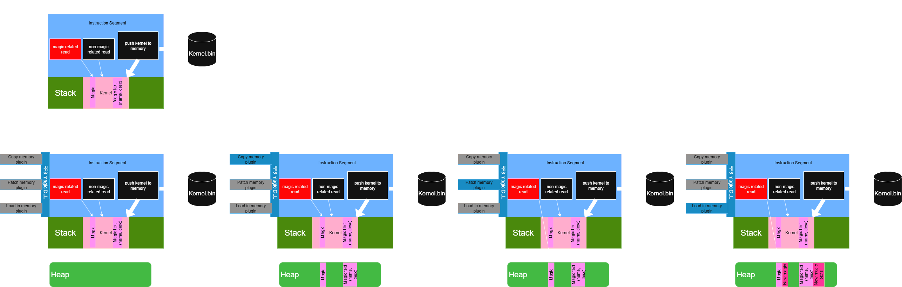

# How-To: Injecting Custom Magic into Final Fantasy VIII

This user guide describes how to use the DLL injector to modify FF8, configuring plugins and injecting new spells and text.

---

## Prerequisites

* **Windows 10/11** (ASLR behavior may vary).
* **Final Fantasy VIII** installed (`FF8_EN.exe`).
* **Injector executable**: `injector.exe`.
* **Host DLL**: `app_hook.dll`.
* **Plugins folder**: contains `memory_plugin.dll`, etc.
* **Configs folder** (TOML):

  * `tasks.toml`
  * `copy_magic_memory_config.toml`
  * `magic_patch.toml`
  * `copy_magic_text_memory_config.toml`
  * `magic_text_patch.toml`
  * `load_new_magic.toml`
  * `load_new_magic_text.toml`

---

## Workflow

The following diagram illustrates the FF8 kernel bypass workflow, showing how the injector modifies the game's memory to load custom magic spells and text:



This diagram shows the process from the original FF8 memory layout through the various stages of memory modification, including:

1. **Original State**: FF8's default memory structure with kernel data
2. **Memory Copy**: Copying existing magic memory for backup/reference
3. **Memory Patching**: Applying patches to modify magic behavior
4. **Final State**: The modified memory layout with custom magic loaded

---

## Directory Structure Example

```text
C:\modding-tools\
│   injector.exe
│   app_hook.dll
├── configs\
│   ├── tasks.toml
│   ├── copy_magic_memory_config.toml
│   └── ...
└── plugins\
    └── memory_plugin.dll
```

> **Working Directory Notes:**
>
> 1. **Before injection**: `injector.exe` resolves `app_hook.dll` and, by default, looks for `configs/` and a default `mods/xtender/tasks` directory relative to its **current working directory** (where you launch it).
> 2. **After injection**: the host DLL runs in the target process’s working directory (the FF8 game folder). All relative paths for loading TOML files and plugin DLLs are resolved there.

---

## 1. Prepare Final Fantasy VIII

1. Copy your **configs/** folder next to `injector.exe`.
2. Copy your **plugins/** folder next to `injector.exe`.
3. To simplify relative paths after injection, either:

   * Copy **configs/** and **plugins/** into the FF8 root folder.
   * Create Windows directory symlinks:

     ```bat
     mklink /D "C:\Games\FF8\configs" "C:\modding-tools\configs"
     mklink /D "C:\Games\FF8\plugins" "C:\modding-tools\plugins"
     ```
   * Or use the `--config-dir` and `--plugin-dir` options when running the injector.

---

## 2. Configure Tasks

Open **configs/tasks.toml** and verify the followBy chains:

```toml
[tasks.copy_magic_memory_config]
followBy = ["load_new_magic", "magic_patch"]

[tasks.copy_magic_text_memory_config]
followBy = ["load_new_magic_text", "magic_text_patch"]
```

Adjust other TOML files as needed (addresses, sizes, file paths).

---

## 3. Run the Injector

1. Open a **Command Prompt** in `C:\modding-tools\` (where `injector.exe` resides).
2. Launch FF8 (`FF8_EN.exe`), or ensure it’s already running.
3. Execute the injector with the target process name:

   ```bat
   injector.exe FF8_EN.exe
   ```

   * Positional argument: `<process_name>` (e.g., `FF8_EN.exe` or `ff8_en`, case-insensitive).
4. **Optional**: specify a custom host DLL name as the second argument (default is `app_hook.dll`):

   ```bat
   injector.exe FF8_EN.exe custom_hook.dll
   ```
5. **Optional**: override config and plugin directories with flags:

   ```bat
   injector.exe FF8_EN.exe app_hook.dll ^
     --config-dir "C:\modding-tools\configs" ^
     --plugin-dir "C:\modding-tools\plugins"
   ```

Internally, the injector:

* Locates the FF8 process using `CreateToolhelp32Snapshot` (waits up to 30 s).
* Writes `%TEMP%\ffscript_loader\injector_config.txt` with `config-dir` and `plugin-dir`.
* Performs `OpenProcess` → `VirtualAllocEx` → `WriteProcessMemory` → `CreateRemoteThread(LoadLibraryA)` to load the host DLL.
* Exits on success or failure.

---

## 4. Verify Injection

1. In FF8, open the **Magic** menu.
2. Confirm your **new spells** and their **descriptions** are present.
3. If not:

   * Verify the **working directory** setup or flags used.
   * Disable ASLR for `FF8_EN.exe` or test on another machine.
   * Check the injector console output for errors.

---

## 5. Troubleshooting & Tips

* **ASLR**: Windows randomizes addresses. If hooks fail, disable ASLR for FF8 (e.g., with `EditFlags.exe`).
* **Admin rights**: Run Command Prompt as **Administrator** if injector can’t open the process.
* **Logging**: Enable debug logging in `HostConfig.toml` by defining `ENABLE_DEBUG_LOG`.
* **Adding plugins**: Drop DLLs into the **plugins/** folder and add corresponding sections in `tasks.toml`.

---

Happy modding! Experiment with other content types or custom C++/Lua plugins using this framework.
